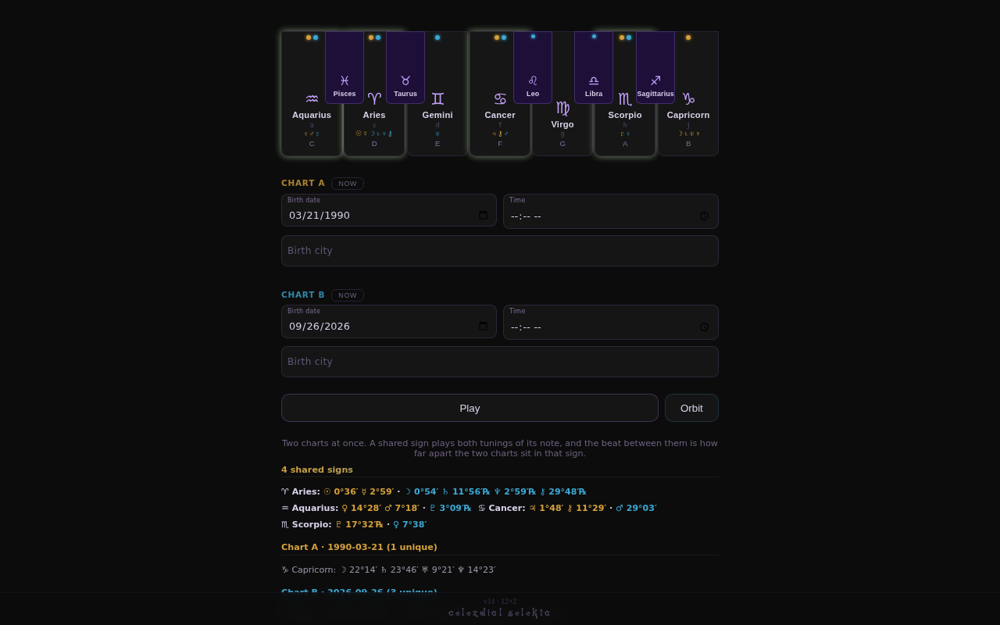

# Celezdial Selekta

A polyphonic ambient synthesizer for the browser that maps the twelve zodiac signs onto the twelve notes of the chromatic scale. Enter one or two birth dates and each planet plays the note of its sign, detuned by its degree within that sign. Angles between planets change the loudness and tuning of the voices, and Orbit mode swells each voice on a cycle set by its ruling planet. It is built with React 18 and Tone.js, with planet positions from circular-natal-horoscope-js.

**Status: shipping.** It is live, but a full two-chart voicing (up to 24 voices) is heavy on older phones.

Live: https://ampactor.dev/celezdial-selekta/



## Quick start

Needs Node.js; CI builds with Node 22.

```sh
npm ci
npm run dev
```

Vite serves the app at http://localhost:3000/celezdial-selekta/ and opens a browser tab. Click a key, or press one of the letters `awsedftgyhuj`, to start a voice. Sound starts on that first gesture. Then enter a birth date under Chart A and press Play to hear the chart.

## Usage

The keyboard toggles voices, and the two chart panels turn birth data into voices. Play sounds the charts and Orbit cycles their voices. The dotted "look within" block near the bottom of the page opens the Controls veil, which holds:

- 39 knobs for the oscillators, envelope and effects
- Eclipse (a chaos mode) and the oscillator type
- the effect chain, the listen preset for your speakers, and MIDI out
- Save, Load and Link for snapshots, plus Record and Perform

[docs/CONTROLS.md](docs/CONTROLS.md) describes every control.

## How it works

The code splits along its seams:

- `src/astro.js` turns birth data into chart activations (which signs sound, each with a detune), body positions and aspects. It gets planet positions from `circular-natal-horoscope-js` and computes the cross-chart aspects itself.
- `src/App.jsx` holds the UI and the visuals. It decides which voices to start, at what velocity and detune, and calls the engine.
- `src/engine.js` builds the Tone.js graph: two banks of twelve `PolySynth` voices (one bank per chart), panners, one summing bus, and an effects chain whose order comes from data.
- `src/signs.js` and `src/tuning.js` hold the numbers: per-sign notes and voicing, per-planet oscillator character, knob defaults and the chain orders.
- `src/snapshot.js` encodes the state for Save, Load and Link, and `src/midi.js` sends Chart A to MIDI hardware.

Data flows one way. Birth data goes into `computeChart`, which returns the active signs and a detune from each body's degree. `aspectVoiceMods` folds the aspects into velocity lifts and tension detunes. The UI triggers the voices, which feed the summing bus and then the effects chain.

These decisions shape the sound:

- **Voices sum before saturation.** A Chebyshev waveshaper on the summed voices creates sum and difference tones between them, so the chord colors itself. See [docs/FX.md](docs/FX.md).
- **No two voices in one octave sit closer than a minor third.** The twelve notes are split across three octaves in diminished-seventh groups. See [docs/VOICES.md](docs/VOICES.md).
- **Tuning comes from the planets.** Each sign is detuned by half of its ruling planet's offset in Hans Cousto's Cosmic Octave, and a chart replaces that with the body's exact degree. See [docs/TUNING.md](docs/TUNING.md).

[docs/ASTROLOGY.md](docs/ASTROLOGY.md) covers the charts, transits, aspects and Orbit.

## Project layout

```
src/
  App.jsx        UI, visuals and playback logic
  engine.js      Tone.js audio graph and knob mapping
  astro.js       chart, aspect and Orbit maths
  signs.js       the twelve voices
  tuning.js      sound-shaping numbers and chain orders
  snapshot.js    Save, Load and share-link codec
  midi.js        Web MIDI out
  presets/       five older tuning profiles (not wired in)
  __tests__/     Vitest tests
docs/            reference for voices, tuning, effects, charts and controls
```

## Deploy

`.github/workflows/deploy.yml` runs on every push to `main`. It runs `npm ci` and `npm run build`, then publishes `build/` to GitHub Pages. The site is served at https://ampactor.dev/celezdial-selekta/, which matches the `base` in `vite.config.js`. To check a production build locally, run `npm run build` and then `npm run preview`.

## Testing

```sh
npm test
npm run lint
```

`npm test` runs 110 Vitest tests in 5 files. They cover:

- the chart maths, including one run against the real ephemeris (the Sun on 1 January 2000 lands in Capricorn)
- cross-chart aspects, aspect velocity lifts and tension partners, and Orbit periods
- the snapshot and share-link codec, including old v12 snapshots and non-ASCII city names
- the shape of the tuning tables and the preset files
- knob value formatting and scaling

`npm run lint` runs ESLint on `src/` and reports no problems. CI builds and deploys but runs neither the tests nor the linter. Nothing tests the audio engine, the UI or MIDI output, and nothing checks how it sounds; that is still done by ear.

## Limitations

A two-chart voicing can put 24 voices through the effects chain at once, which is a lot for Web Audio on an older phone. Nothing scales quality down automatically, so on weak hardware the player has to drop voices by hand. Tone.js scheduling depends on the browser, so timing under load is not guaranteed.

- CI runs no tests, so a change that breaks the chart maths can still deploy.
- Chart maths runs in the browser, but typing a birth city sends the text to OpenStreetMap's Nominatim search, and the now button sends your coordinates to its reverse lookup.
- Loading a snapshot or link restores the knobs, chain and chart inputs. It does not restore the active keys, Eclipse or Orbit, although the file records them.
- MIDI out carries Chart A only.
- In bank A the four pan-group LFOs override each voice's fixed pan position, and they start together at the same rate, so the groups move in step.
- The profiles in `src/presets/` are out of date. Each lacks ten settings the engine now reads, so none works as a replacement for `src/tuning.js`.

## License

No license chosen yet. The Spiral ST font in `public/fonts/spiral-st/` comes with its own terms, in `1001fonts-spiral-st-eula.txt`.
